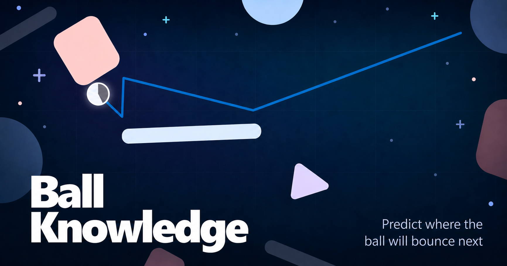

# Ball Knowledge

Ball Knowledge is a browser game about predicting where a bouncing ball will rebound next. Players get three lives. The game generates random boards with random different obstacle layouts, so every game is different. The game has a social aspect, where players can challenge their friends, or compete globally on the daily puzzle.

## Features

- Random boards with local best-score tracking.
- Shareable friend challenges with per-challenge leaderboards.
- Daily challenge boards with daily leaderboards and local streak state.
- Server-side score verification, initials filtering, and API rate limits.
- Open Graph / Twitter share metadata for root, challenge, and daily links.

## Development

```sh
npm install
npm run dev
```

Vite runs the client app. Vercel API rewrites are not emulated by plain Vite, so use Vercel's local runtime when testing share pages or API routes end to end:

```sh
vercel dev
```

## Checks

```sh
npm run lint
npm run test
npm run build
```

## Sharing

Public share pages:

- Challenge: `/c/:slug`
- Daily: `/d/YYYY-MM-DD`

Both pages emit crawler-friendly metadata and use the static preview image at:

```text
/share/ball-knowledge-share.png
```

After deploying, verify:

```sh
curl -I https://ball-knowledge.kabibi.io/share/ball-knowledge-share.png
curl https://ball-knowledge.kabibi.io/c/YOUR_SLUG
curl https://ball-knowledge.kabibi.io/d/2026-05-01
```

Discord and other chat apps cache previews aggressively. If a preview was previously broken, test with a fresh challenge slug or add a harmless query string while debugging.

## Deployment

The app is set up for Vercel. `vercel.json` rewrites challenge and daily share URLs to serverless functions, then falls back to the Vite app for normal gameplay routes.
